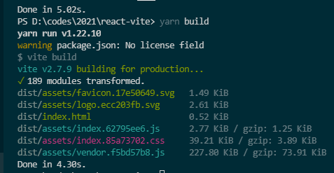

# React-vite 项目脚手架

1. 配置 antd 支持, 并通过 vite-plugin-imp 实现按需引入样式
2. 配置 prettier 支持, 提交时默认格式化
3. 配置 react-hook 语法检查, 减少 hook 书写时可能导致的 bug
4. 使用 styled-components 实现更好的 css in js 书写体验
5. 包含一些阅读 react 官方文档时写的 jsx 样例

## TODO

- 图表绘制
- 其他组件库（antd 的按需引入不太方便）
- gis 支持
- tsx 学习
- react graphql typescript

react 的事件处理有点复杂，vue 好像不用关注这些细节
使用 class field 实验性语法比较好：

```js
class LoggingButton extends React.Component {
  // 此语法确保 `handleClick` 内的 `this` 已被绑定。
  // 注意: 这是 *实验性* 语法。
  handleClick = () => {
    console.log('this is:', this)
  }

  render() {
    return <button onClick={this.handleClick}>Click me</button>
  }
}
```

使用 vite-plugin-imp 进行了 css 按需加载，打包体积如下：

[参考链接](https://juejin.cn/post/6938671679153373214#heading-5)
[官方推荐的校验库-formik](https://formik.org/)
[配置 eslint，prettier，husky](https://dev.to/smetankajakub/how-to-integrate-husky-eslint-prettier-to-project-in-less-than-15-minutes-5gh)

官方建议不使用继承，组件的继承关系可以用组合，类似 v-slot 的方式实现；

## React 写 css 方案调研

[如何在 React 中优雅的写 CSS-InfoQ](https://www.infoq.cn/article/ftlppdefo27prgqhlo5a)
如果无法引入 styled-components，应该还有 css modules 可以选择，虽然不太方便

tsx 中使用 styled-components 需要添加：@types/styled-components
